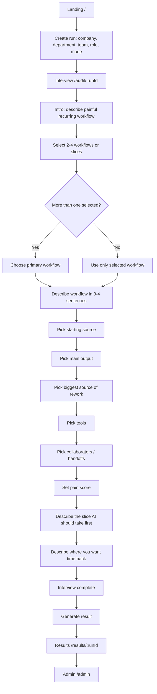

# Workflow Audit Agent Product Canvas

## Scope
This document is scoped to the standalone Workflow Audit Agent in `/Users/tomharpaz/profai/apps/workflow-audit`.

Section Coach is relevant as product context and future integration surface, but this canvas describes the Workflow Audit Agent as its own prototype product.

Verified against the current codebase on April 15, 2026.

## Product Definition
The Workflow Audit Agent is a standalone interview-and-recommendation product that helps a knowledge worker describe a recurring workflow, surfaces the highest-value automation opportunities inside that workflow, generates one concrete AI setup to try immediately, and rolls those interviews up into an admin view that shows where automation opportunities are clustering across a team.

Today, the product exists as:

- A user launch flow with company, department, team, role, and generation mode capture
- A bounded mixed-UI workflow interview
- A personalized results page with ranked opportunities and one hero prompt/setup artifact
- An admin dashboard with aggregate completion metrics, heatmap, connections, and learned team patterns
- A circular learning loop based on prior completed runs from the same company and team

## Why This Exists In The Section Ecosystem
Section Coach today helps people discover and execute AI use cases. The Workflow Audit Agent extends that logic one layer deeper:

- Section Coach starts from a use case or prompt need
- Workflow Audit Agent starts from a real workflow that is painful, repetitive, or messy
- Section Coach helps a user execute
- Workflow Audit Agent helps identify where execution should happen in the first place

In other words, this prototype is a workflow-level discovery surface that can eventually feed better use-case recommendations, company pattern libraries, and more actionable admin guidance back into Section Coach.

## Problem Statement
Enterprise AI buyers do not have a standardized way to show progress from AI adoption to workflow transformation.

The tension:

- Heads of AI, transformation leads, and CIOs are expected to show value quickly
- Most enterprise AI rollouts focus on tool access or training, not workflow-level integration
- Employees often do not know what to automate, what tool to use, or how to describe their work in an AI-ready way
- Leaders therefore lack a credible map of where high-value automation opportunities are clustered across teams

The Workflow Audit Agent solves a narrower, more concrete version of that problem:

- For the individual: it turns messy day-to-day work into a ranked, immediately useful AI starting point
- For the admin: it aggregates repeated workflow pain into an evidence base for what to automate first

This is valuable because it makes AI transformation less abstract. Instead of asking whether a team is “using AI,” it asks:

- What workflows are dragging?
- Where do inputs, outputs, and handoffs break down?
- Which slices are ready for AI assistance now?

## Target Personas

| Persona | Current Product Support | Core Need | What They Get Today |
| --- | --- | --- | --- |
| End user / knowledge worker | Strong | Help on a real workflow this week | Guided workflow interview, ranked opportunities, recommended setup, reusable prompt |
| Team lead | Weak / mostly implied | Understand what workflows on the team are worth standardizing | No dedicated view today; only indirect visibility through admin patterns |
| Admin / consultant / Head of AI | Partial | See cross-team opportunity clusters and workflow patterns | Read-only admin dashboard with heatmap, patterns, top opportunities, and connections |
| Executive buyer / CIO | Weak / implied | Executive-friendly evidence of AI transformation progress | No dedicated executive view; can be served indirectly by admin dashboard screenshots and narration |

## Jobs To Be Done

### End user
- Help me describe my work in a way AI can actually do something with
- Show me where AI could save time this week
- Give me a setup I can use immediately, not just theory

### Team lead
- Show me what workflows repeatedly slow my team down
- Help me see where standardization or push-down automation could help

### Admin / consultant
- Show me where automation opportunities are clustering
- Help me prioritize what to automate first
- Give me evidence that more interviews improve the signal

### Executive buyer
- Give me a simple story about where value is emerging
- Help me move the conversation from training activity to workflow impact

## What Is Actually Built

### Current product pillars in code
- User launch flow at `/`
- Interview flow at `/audit/:runId`
- Results flow at `/results/:runId`
- Admin aggregate dashboard at `/admin`
- Mock mode and Live OpenAI mode
- In-memory mode and Postgres mode
- Seeded demo data to guarantee non-empty admin and prior-pattern behavior

### What this prototype is not yet
- It is not embedded into the main Section Coach product
- It is not authenticated
- It is not multi-tenant in a production sense
- It is not an action-heavy admin console
- It does not yet include a team lead inbox or push-to-team workflow
- It does not yet include an executive reporting layer

## Complete User Flow Map

## Screen-By-Screen Map

### 1. Landing page `/`
Purpose:

- Launch a new workflow audit
- Capture demo profile fields
- Choose generation mode
- Link to the admin view

Current content:

- Workflow Audit Agent framing
- Two value cards
- Form for company, department, team, role title, optional focus area
- Mode toggle: `Mock` or `Live OpenAI`
- CTA: `Start workflow audit`

Decision points:

- `generationMode = mock` means deterministic local generation
- `generationMode = live` means real OpenAI calls if `OPENAI_API_KEY` exists

### 2. Audit page `/audit/:runId`
Purpose:

- Conduct the workflow interview
- Save progress turn by turn
- Show thread, progress, and stage framing

Current layout:

- Main interview card
- Right rail with thread, progress, audit stages, reminders, and return-home CTA

Interview sequence in code:

1. `intro-friction`
2. `task-selection`
3. `primary-task` if more than one workflow was selected
4. `task-detail-{index}`
5. `starting-source`
6. `main-output`
7. `rework-source`
8. `task-tools`
9. `task-collaborators`
10. `task-pain-{index}`
11. `workflow-automation-wish`
12. `aspirational-focus`

Decision points:

- Prior team patterns change the opener and seed the task selection list
- If multiple workflows are selected, the user chooses one primary workflow
- Live mode enhances language extraction and message tone, but the interview path itself is bounded

### 3. Results page `/results/:runId`
Purpose:

- Turn the interview into a useful output artifact

Current content:

- Processing state with three stages:
  - Mapping workflows
  - Finding top opportunities
  - Building your prompt
- Final state with:
  - Best first move card
  - Ranked automation opportunities
  - Hero prompt/setup artifact
  - Human judgment section
  - Recommended next step
  - Workflow connections

### 4. Admin page `/admin`
Purpose:

- Show aggregate signal from completed audits

Current content:

- Total runs, completed runs, teams represented
- `What to automate first` recommendation card
- Heatmap by team x category
- Top automation opportunities
- Cross-team workflow connections
- Learned team patterns
- `Reset sample data` admin utility

### 5. Not Found page `*`
Purpose:

- Recover gracefully if a route is wrong

Current content:

- Return path to home
- Link to admin

## Feature Inventory

| Feature | Status | Demo readiness | Evidence in code | Notes |
| --- | --- | --- | --- | --- |
| Launch flow with company/team/role capture | ✅ Complete | Yes | `src/pages/LandingPage.tsx` | Good enough for demo |
| Mock vs Live OpenAI mode toggle | ✅ Complete | Yes | `LandingPage.tsx`, `src/server/env.ts` | Useful for demo safety |
| Mixed-UI interview flow | ✅ Complete | Yes | `AuditPage.tsx`, `QuestionComposer.tsx` | Bounded and reliable |
| Adaptive team-aware opener | ✅ Complete | Yes | `buildInitialAssistantMessage`, `getPriorPatterns` | Works when prior completed runs exist |
| Circular learning loop example | ✅ Complete | Yes | seeded demo + prior pattern aggregation | Same-company same-team only |
| Live OpenAI interview enhancement | 🟡 Partial | Yes, with caveats | `runInterviewAgent` | Enhances wording/extraction, does not control flow |
| Workflow specialist pass | 🟡 Partial | Yes | `runWorkflowSpecialist` | Falls back to mock on failure |
| Recommendation generation | ✅ Complete | Yes | `runRecommendationAgent`, `ResultsPage.tsx` | Produces ranked list + setup artifact |
| Hero prompt/setup artifact | ✅ Complete | Yes | `ResultsPage.tsx` | Strongest demo output today |
| Recommended surface selection | ✅ Complete | Yes | `chooseRecommendedSurface` | Supports project / custom GPT / scheduled task / prompt |
| GPT-5.4 family recommendation | ✅ Complete | Yes | prompts + env defaults | Constrained to GPT-5.4 family |
| Admin read-only dashboard | ✅ Complete | Yes | `AdminPage.tsx`, `admin.ts` | Good summary surface |
| What-to-automate-first synthesis | ✅ Complete | Yes | `buildAdminRecommendation` | Good for demo storytelling |
| Optional Postgres persistence | 🟡 Partial | Not enabled by default | `postgres.ts`, `schema.ts`, `repository.ts` | Requires env + DB |
| In-memory demo persistence | ✅ Complete | Yes | `memory.ts` | Resets on server restart |
| Seeded demo data | ✅ Complete | Yes | `services/demo.ts` | Critical for reliable demo |
| Team lead workflow acceptance flow | 🔴 Missing | No | Not present | No team lead screen or action model |
| Admin action to push workflows to teams | 🔴 Missing | No | Not present | Admin is reporting-only |
| Company-wide promoted workflow library | 🔴 Missing | No | Not present | No library route or save-to-library action |
| Section Coach handoff | 🔴 Missing | No | Not present | Only conceptual today |
| Executive reporting layer | 🔴 Missing | No | Not present | Admin page is not executive-tailored |
| Export / share results | 🔴 Missing | No | Not present | No PDF/CSV/export |
| Authentication and role-based access | 🔴 Missing | No | Not present | Local demo app only |

## Peer Recommendation Engine

## What exists technically today
The current “peer” logic is a team-pattern engine, not yet a generalized “people like you” cohort model.

Technical behavior:

1. Completed runs are stored in the repository
2. `getPriorPatterns()` filters runs by:
   - `companyName`
   - `team`
   - `status === complete`
3. `buildTeamPatternsFromRuns()` aggregates:
   - recurring tasks
   - common tools
   - common pain points
   - respondent count
4. Those patterns are injected into:
   - the initial assistant framing
   - the initial state
   - the task-selection options
   - the results payload
   - the admin dashboard

Files:

- `src/server/services/patterns.ts`
- `src/server/services/run-service.ts`
- `src/server/agents/prompts.ts`
- `src/server/services/demo.ts`

## How “we interviewed 7 people like you” maps to the current code
The literal phrase and UI treatment do not exist today.

What exists instead:

- Team-level respondent count
- Team-level recurring tasks
- Team-level tool and pain-point summaries
- A team-aware intro message such as “X teammates on your team mentioned…”

So the current product is closer to:

- “We’ve already learned some patterns from your team”

not yet:

- “We interviewed 7 people like you across similar roles and here’s what they found”

## Relationship between individual and peer-based recommendations
Today the relationship is:

- Individual answers drive the final recommendation
- Peer patterns seed the interview and make it shorter/smarter
- Peer patterns also show up in the final result and admin view as supporting evidence

What peer patterns do not do yet:

- They do not independently generate top opportunities
- They do not create explicit “people like you” cards on the results page
- They do not compute similarity by role, department, company size, or workflow archetype

## Why this still matters for the demo
Even in its current form, the circular learning loop is real enough to demo:

- Seed one completed RevOps run
- Start a new RevOps run
- Show that the second user gets team-aware framing and seeded workflow options
- Then show the admin dashboard reflecting both completed runs

That is a credible “the system gets smarter with more participation” story.

## Gap Analysis

### Highest-priority gaps for the demo

1. Admin is still read-only
The admin dashboard can identify what to automate first, but it cannot take action on that recommendation. There is no push-to-team, assign, or publish mechanism.

2. Peer signal is present, but not productized enough
The engine exists, but the UX does not yet make the peer layer feel central. There is no explicit “people like you” module, no visible cohort explanation, and no stronger results-page reinforcement.

3. No team lead flow
There is no middle layer between admin insight and end-user execution. That means the “push workflows to teams” story is still mostly conceptual.

4. No persistent storage by default
The circular learning loop is strongest when interviews survive restarts. The app supports Postgres, but local default mode is still in-memory.

5. No clear handoff into operational use
The output artifact is strong, but there is no next action such as:

- Save to library
- Push to team
- Open as project
- Assign to lead

6. No executive-ready summary layer
The admin page is useful for a builder or consultant, but not yet packaged for CIO-level storytelling.

### Admin-specific gaps

| Gap | Impact | Why it matters |
| --- | --- | --- |
| No actions on opportunities | Very high | Prevents the admin story from ending in “so what?” |
| No push-to-team workflow | Very high | Missing the bridge from insight to adoption |
| No team lead recommendation queue | High | No downstream acceptance or rollout view |
| No adoption state model | High | Cannot show what was pushed, accepted, or in progress |
| No executive summary/export | Medium | Harder to sell ROI narrative |
| No auth / org boundaries | Medium | Fine for demo, not for real deployment |

### Results and coaching flow gaps

| Gap | Impact | Why it matters |
| --- | --- | --- |
| Peer evidence is understated | High | One of the most differentiated ideas in the concept |
| No save/share/export action | Medium | Weakens perceived usefulness |
| No direct Section Coach handoff | Medium | Limits the “fits into the ecosystem” story |
| Interview still feels like a product prototype rather than a fully polished assistant | Medium | Mostly a copy and UI polish issue |

## Demo-Ready Story

## Core value proposition
The Workflow Audit Agent is differentiated because it combines three things in one loop:

1. Personalized workflow discovery
It starts from the work a person actually does, not a generic use-case catalog.

2. Peer-informed intelligence
It gets smarter as more people on a team complete the audit.

3. Admin-visible prioritization
It turns individual workflow pain into a visible map of where automation opportunities cluster.

## What the audience should understand by the end

- This is not a survey
- This is not a prompt library
- This is not just chat
- It is a workflow-to-recommendation system with both individual and org value

## Suggested 5-10 minute demo narrative

### 1. Frame the problem
“Most enterprise AI programs know who has tool access, but not which workflows are actually ready for AI. The Workflow Audit Agent closes that gap.”

### 2. Show the user launch
Enter a role and team. Mention that this can sit alongside Section Coach as the workflow-discovery layer.

### 3. Show a few interview moments
Demonstrate:

- the workflow-first opener
- mixed UI instead of pure chat
- a team-aware cue if prior patterns exist

Do not spend the whole demo inside the interview. Use 2-3 steps, then jump to the end if needed.

### 4. Show the result
Land on:

- ranked opportunities
- best recommended setup
- hero prompt/setup artifact

This is the strongest proof of immediate user value.

### 5. Show the admin view
Open `/admin` and show:

- completed runs
- heatmap
- top opportunities
- learned team patterns
- what to automate first

This is the strongest proof of strategic value.

### 6. Close on the loop
“Each additional interview improves the next interview and sharpens the admin signal. That is how Section moves from tool enablement to workflow transformation.”

## Recommended Demo Order

1. Landing page
2. Team-aware first question
3. One or two mixed-UI steps
4. Final results page
5. Admin dashboard
6. Close with future state: push-to-team and Section Coach handoff

## Tomorrow’s Product Priorities

### Must-have for a strong hackathon demo
- Keep the user flow stable and crisp
- Make peer signal more explicit in the user result and admin narrative
- Add at least one lightweight admin action stub so the admin story ends with action, not just reporting
- Tighten copy so every screen reinforces “workflow audit agent”

### Nice-to-have
- Persistent DB-backed runs
- Team lead handoff surface
- Save-to-library or export action
- Executive summary card

## Bottom Line
The Workflow Audit Agent already works as a credible end-to-end prototype.

Its biggest strengths today are:

- clear workflow-first framing
- strong immediate user payoff
- visible admin aggregation
- believable circular learning loop

Its biggest missing piece is not the user flow. It is the admin action layer that turns “we found something important” into “we can now roll this workflow out.”
