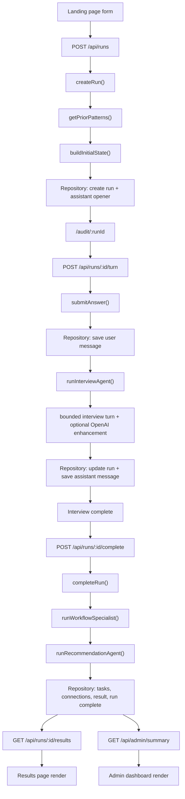

# Workflow Audit Agent Tech Spec

## Scope
This document covers the standalone Workflow Audit Agent in `/Users/tomharpaz/profai/apps/workflow-audit`.

It does not document the broader ProfAI / Section Coach codebase except where that context helps explain future integration points.

Verified against the current codebase on April 15, 2026. Current verification state:

- `npm test` passes
- `npm run build` passes

## Architecture Overview

## Summary
The Workflow Audit Agent is a standalone Vite + React application with a thin server layer implemented in two interchangeable forms:

- Vercel-style API route handlers under `api/`
- A Vite dev-server middleware that emulates those API routes locally

The product uses:

- BrowserRouter-based frontend routes
- Zod contracts shared by client and server
- A service layer for run creation, answer submission, result generation, admin summary generation, and demo resets
- A repository abstraction that can run either:
  - in memory
  - in Postgres via Drizzle
- An OpenAI integration layer that supports:
  - bounded interview enhancement
  - workflow specialist output
  - recommendation/result generation
- Deterministic fallback behavior when OpenAI is unavailable or a live structured-output step fails

## Tech stack

| Layer | Technology | Notes |
| --- | --- | --- |
| Frontend | React 19 | SPA rendering |
| Routing | React Router 7 | `BrowserRouter` |
| Build tool | Vite 5 | Also powers local dev API middleware |
| Language | TypeScript | Frontend and server |
| Validation | Zod | Shared contracts and API parsing |
| Server API | Vercel-style functions + Vite middleware | Local and deployable |
| AI provider | OpenAI SDK v4 | Uses `beta.chat.completions.parse` with structured outputs |
| Database ORM | Drizzle ORM | Postgres schema and repository |
| Database | Postgres via `pg` | Optional, env-driven |
| Tests | Vitest + Testing Library | Contract, service, and page coverage |
| Deploy target | Vercel-style static + serverless layout | `vercel.json` present |

## Runtime modes

### Generation mode
- `mock`
- `live`

Behavior:

- `mock` keeps the interview path and result generation deterministic and local
- `live` uses OpenAI for interview enhancement, specialist output, and recommendation output

### Storage mode
- in-memory repository if no DB URL exists
- Postgres repository if `WORKFLOW_AUDIT_DATABASE_URL` or `DATABASE_URL` exists

## Environment variables

Defined in:

- `src/server/env.ts`
- `.env.example`

Supported values:

| Variable | Purpose | Default |
| --- | --- | --- |
| `OPENAI_API_KEY` | Enables live OpenAI mode | empty |
| `WORKFLOW_AUDIT_DATABASE_URL` | Enables Postgres persistence | empty |
| `DATABASE_URL` | Fallback DB URL | empty |
| `WORKFLOW_AUDIT_OPENAI_MODEL` | Base model family | `gpt-5.4` |
| `WORKFLOW_AUDIT_INTERVIEW_MODEL` | Interview enhancement model | `gpt-5.4` |
| `WORKFLOW_AUDIT_SPECIALIST_MODEL` | Specialist model | `gpt-5.4-mini` |
| `WORKFLOW_AUDIT_RECOMMENDATION_MODEL` | Final result model | `gpt-5.4` |

Note:

- `.env.example` also includes `VITE_API_BASE_URL`, but the current frontend API client does not use it

## High-Level Data Flow



## File / Folder Structure Map

```text
apps/workflow-audit
├── api/
│   ├── _utils.ts
│   ├── admin/summary.ts
│   ├── demo/reset.ts
│   └── runs/
│       ├── index.ts
│       └── [id]/
│           ├── index.ts
│           ├── turn.ts
│           ├── complete.ts
│           └── results.ts
├── drizzle/
│   └── 0000_workflow_audit.sql
├── public/
│   ├── fonts/
│   └── images/
├── src/
│   ├── components/
│   │   ├── admin/
│   │   ├── interview/
│   │   └── ui/
│   ├── lib/
│   ├── pages/
│   ├── server/
│   │   ├── agents/
│   │   ├── db/
│   │   ├── repositories/
│   │   └── services/
│   ├── styles/
│   └── test/
├── index.html
├── package.json
├── vercel.json
├── vite.config.ts
└── vitest.config.ts
```

## Module map

### `api/`
Vercel-style serverless handlers.

- `runs/index.ts`
  - create run
- `runs/[id]/index.ts`
  - fetch run view
- `runs/[id]/turn.ts`
  - save answer and advance interview
- `runs/[id]/complete.ts`
  - run specialist + recommendation pipeline
- `runs/[id]/results.ts`
  - fetch final result
- `admin/summary.ts`
  - fetch admin aggregate
- `demo/reset.ts`
  - reseed sample data
- `_utils.ts`
  - small request/response helpers

### `src/pages/`
Screen-level route components.

- `LandingPage.tsx`
- `AuditPage.tsx`
- `ResultsPage.tsx`
- `AdminPage.tsx`
- `NotFoundPage.tsx`

### `src/components/ui/`
Reusable UI primitives.

- `Button.tsx`
- `Card.tsx`
- `PageLayout.tsx`
- `ProgressBar.tsx`

### `src/components/interview/`
Interview-specific UI.

- `QuestionComposer.tsx`

### `src/components/admin/`
Admin-specific UI.

- `Heatmap.tsx`

### `src/lib/`
Shared frontend contracts and API client.

- `contracts.ts`
- `api.ts`
- `demo.ts`

### `src/server/agents/`
LLM logic and prompt construction.

- `openai.ts`
- `prompts.ts`

### `src/server/services/`
Application business logic.

- `run-service.ts`
- `patterns.ts`
- `admin.ts`
- `demo.ts`
- `repository.ts`

### `src/server/repositories/`
Storage abstraction.

- `types.ts`
- `memory.ts`
- `postgres.ts`

### `src/server/db/`
Database setup.

- `client.ts`
- `schema.ts`

### `src/styles/`
Design tokens, fonts, and global CSS.

- `tokens.css`
- `fonts.css`
- `global.css`

## Route Map

### Frontend routes

| Route | Component | Purpose |
| --- | --- | --- |
| `/` | `LandingPage` | Launch a run |
| `/audit/:runId` | `AuditPage` | Conduct interview |
| `/results/:runId` | `ResultsPage` | Show processing or final output |
| `/admin` | `AdminPage` | Show aggregate admin insights |
| `/home` | redirect | Alias to home |
| `*` | `NotFoundPage` | Fallback |

### API routes

| Method | Route | Handler | Purpose |
| --- | --- | --- | --- |
| `POST` | `/api/runs` | `api/runs/index.ts` | Create a new run |
| `GET` | `/api/runs/:id` | `api/runs/[id]/index.ts` | Load run + messages |
| `POST` | `/api/runs/:id/turn` | `api/runs/[id]/turn.ts` | Save answer and get next turn |
| `POST` | `/api/runs/:id/complete` | `api/runs/[id]/complete.ts` | Generate final output |
| `GET` | `/api/runs/:id/results` | `api/runs/[id]/results.ts` | Fetch completed result |
| `GET` | `/api/admin/summary` | `api/admin/summary.ts` | Fetch admin summary |
| `POST` | `/api/demo/reset` | `api/demo/reset.ts` | Reset to seeded demo state |

## Local dev API behavior
The app’s local `vite` dev server is augmented by a custom middleware plugin in `vite.config.ts`.

That middleware:

- intercepts `/api/*` requests
- SSR-loads `run-service.ts` and `contracts.ts`
- handles the same routes locally that Vercel would handle in deployment

This is why `npm run dev` works without separately starting an API server.

## Deployment behavior
`vercel.json` rewrites all non-API, non-static routes back to `index.html`, making the SPA routable on Vercel while preserving serverless API route behavior.

## Component Inventory

## Reusable UI primitives

| Component | File | Current functionality | Inputs / props | Design tokens applied | Current visual state | Known issues |
| --- | --- | --- | --- | --- | --- | --- |
| `Button` | `src/components/ui/Button.tsx` | Styled action button | `variant`, `size`, native button props | Yes | Pill-shaped primary/secondary/ghost | No loading style abstraction beyond inline content |
| `ButtonLink` | same | Internal route action | `variant`, `size`, `LinkProps` | Yes | Matches button styling | None |
| `ButtonAnchor` | same | External anchor action | `variant`, `size`, anchor props | Yes | Matches button styling | None |
| `Card` | `src/components/ui/Card.tsx` | Generic glass card shell | `title`, `description`, `tone`, `aside`, `children` | Yes | Rounded glass panel with tone variants | Heavy reuse can flatten page hierarchy |
| `PageLayout` | `src/components/ui/PageLayout.tsx` | Shared page shell with title and home link | `eyebrow`, `title`, `subtitle`, `actions`, `children` | Yes | Consistent header and Section/Home affordance | No breadcrumb depth beyond home |
| `ProgressBar` | `src/components/ui/ProgressBar.tsx` | Linear progress bar | `progress`, `label`, `detail` | Yes | Gradient bar with label row | No stage segmentation |

## Interview UI

| Component | File | Current functionality | Inputs / props | Design tokens applied | Current visual state | Known issues |
| --- | --- | --- | --- | --- | --- | --- |
| `QuestionComposer` | `src/components/interview/QuestionComposer.tsx` | Renders text, slider, single-select, multi-select, and chips cards | `card`, `disabled`, `isSubmitting`, `onSubmit` | Yes | Large question header, white input surface, pill CTA | One component owns many input modes, so complexity will grow if interview types expand |

## Admin UI

| Component | File | Current functionality | Inputs / props | Design tokens applied | Current visual state | Known issues |
| --- | --- | --- | --- | --- | --- | --- |
| `Heatmap` | `src/components/admin/Heatmap.tsx` | Displays team x category density | `heatmap` | Yes | Horizontally scrollable grid with intensity cells | Can still get cramped with many categories |

## Page-level components

| Screen | File | Current state and functionality | Props / inputs | Design tokens applied | Visual state description | Known issues |
| --- | --- | --- | --- | --- | --- | --- |
| Landing | `src/pages/LandingPage.tsx` | Form to start a run and choose mode | internal state only | Yes | Strong hero, two-column layout, polished launch card | Copy can still be tightened for presentation mode |
| Audit | `src/pages/AuditPage.tsx` | Main interview, thread, progress, stages | route param `runId` | Yes | Large current-question card with sticky side rail | Right rail can still feel secondary on smaller screens |
| Results | `src/pages/ResultsPage.tsx` | Processing state and final output | route param `runId`, optional prefetched result | Yes | Strong two-column layout, hero setup card, prompt block | Processing state and retry logic are more complex than ideal |
| Admin | `src/pages/AdminPage.tsx` | Aggregate metrics and insights | none | Yes | Dense dashboard cards, compact scroll regions | Stronger action layer is still missing |
| Not found | `src/pages/NotFoundPage.tsx` | Recovery route | none | Yes | Minimal fallback card | Fine for demo |

## Core Contracts and Data Models

Defined in `src/lib/contracts.ts`.

## Interview and run contracts

| Schema | Purpose |
| --- | --- |
| `questionOptionSchema` | One option inside a card |
| `questionVariantSchema` | Card kind enum |
| `interviewQuestionCardSchema` | Full question card payload |
| `taskDetailSchema` | Structured representation of one workflow |
| `runProfileSchema` | Company, department, team, role |
| `generationModeSchema` | `mock` or `live` |
| `interviewStateSchema` | Full mutable run state |
| `extractedPatchSchema` | Partial state patch from a turn |
| `interviewTurnResponseSchema` | Assistant message + next card + extracted state |
| `runMessageSchema` | Transcript message record |
| `runViewSchema` | Run + messages payload for UI |
| `answerPayloadSchema` | User answer payload |

## Output contracts

| Schema | Purpose |
| --- | --- |
| `workflowOpportunitySchema` | Ranked opportunity entry |
| `promptSurfaceSchema` | Delivery surface enum |
| `promptArtifactSchema` | Hero setup / prompt artifact |
| `workflowConnectionSchema` | Workflow dependency / handoff item |
| `teamPatternSchema` | Aggregated team signal |
| `workflowAuditResultSchema` | Final user result payload |
| `workflowSpecialistOutputSchema` | Intermediate specialist output |
| `adminHeatmapCellSchema` | Admin heatmap cell |
| `adminSummarySchema` | Full admin dashboard payload |

## Request / response contracts

| Schema | Purpose |
| --- | --- |
| `createRunRequestSchema` | Start-run payload |
| `createRunResponseSchema` | Start-run response |

## Repository data model

Defined in `src/server/repositories/types.ts`.

Interfaces:

- `StoredRun`
- `StoredMessage`
- `StoredTask`
- `StoredConnection`
- `WorkflowAuditRepository`

Repository methods:

- `createRun`
- `updateRun`
- `getRun`
- `listRuns`
- `appendMessage`
- `listMessages`
- `replaceTasks`
- `listTasks`
- `replaceConnections`
- `listConnections`
- `saveResult`
- `getResult`
- `reset`

## Database schema

Defined in `src/server/db/schema.ts`.

Tables:

### `workflow_audit_runs`
- identity and profile fields
- generation mode
- status
- progress
- JSONB interview state
- JSONB prior patterns
- timestamps

### `workflow_audit_messages`
- per-turn transcript messages
- role
- card kind
- content
- payload
- timestamp

### `workflow_audit_tasks`
- normalized task/workflow records extracted from a run
- tools
- collaborators
- pain score
- estimated hours
- category

### `workflow_audit_connections`
- normalized workflow handoffs/dependencies

### `workflow_audit_results`
- final result JSON blob per run

## Persistence behavior

### In-memory mode
Used when no database URL is set.

Pros:

- zero setup
- perfect for local demo iteration

Cons:

- data is lost on server restart
- circular learning only persists inside the current process

### Postgres mode
Used when a DB URL is set.

Pros:

- runs persist across restarts
- team patterns become durable
- admin view becomes meaningfully cumulative

Cons:

- requires DB provisioning and migration setup

## Interview Engine Design

## Current architecture
The interview system is intentionally not fully open-ended.

It is a bounded flow with optional LLM enhancement.

That means:

- the interview path is deterministic enough to complete reliably
- OpenAI improves message quality and extracts useful details
- OpenAI does not fully choose the next branch

This design was chosen to avoid endless loops and unstable live behavior.

## Interview state machine
Implemented primarily in `src/server/agents/openai.ts` using `buildMockInterviewTurn()`.

Current step sequence:

1. Intro friction
2. Task selection
3. Primary task selection if needed
4. Task detail summary
5. Starting source
6. Main output
7. Rework source
8. Tools
9. Collaborators
10. Pain
11. Automation wish
12. Aspirational focus

## OpenAI usage

### Interview enhancement
Function:

- `runInterviewAgent()`

What it does:

- gets baseline next turn from the bounded engine
- if live mode is enabled, calls OpenAI
- rewrites the assistant message
- extracts:
  - friction summary
  - workflow summary
  - inferred tasks
  - inferred tools
  - inferred collaborators
  - automation wish
- merges those extracted fields back into the baseline turn

What it does not do:

- choose arbitrary next steps
- dynamically branch the entire interview tree

### Workflow specialist
Function:

- `runWorkflowSpecialist()`

What it does:

- converts interview state into opportunities and connections
- falls back to local mock output if the live call fails

### Recommendation agent
Function:

- `runRecommendationAgent()`

What it does:

- creates final user-facing result
- chooses recommended delivery surface
- chooses GPT-5.4 family model
- builds hero prompt/setup artifact
- falls back to local mock output if the live call fails

## Important engineering implication
Specialist and recommendation failures are intentionally hidden behind deterministic fallbacks.

That is good for demo resilience, but it means:

- the app can appear to work even if a live model step failed
- “live mode” does not guarantee that every downstream artifact was actually generated live

If tomorrow’s demo depends on explicitly proving live AI generation, this fallback behavior should be surfaced in a lightweight debug indicator or log.

## Prompting Layer

Defined in `src/server/agents/prompts.ts`.

Prompt responsibilities:

- `getRoleTemplate()`
  - role-based default tasks and tools
- `buildInitialAssistantMessage()`
  - team-aware opener
- `buildInterviewSystemPrompt()`
  - interview rules for deeper but bounded questioning
- `buildSpecialistPrompt()`
  - normalization instructions
- `buildRecommendationPrompt()`
  - final result shaping instructions

Notable current behavior:

- recommendation prompt forces GPT-5.4 family outputs
- role templates provide first-pass task and tool seeds
- team prior patterns are injected into the interview system prompt

## Peer / Pattern Data Flow

Current logic path:

1. `createRun()` calls `getPriorPatterns(repository, companyName, team)`
2. `getPriorPatterns()` filters completed runs by exact company + team match
3. `buildTeamPatternsFromRuns()` summarizes tasks, tools, and high-pain items
4. Prior patterns are injected into:
   - run state
   - initial assistant note
   - task selection list
   - results output
   - admin dashboard

This means the “peer engine” is currently:

- company-specific
- team-specific
- built from the same app’s historical runs

It is not:

- cross-role matching
- cross-company benchmarking
- semantic similarity matching

## Admin Aggregation Logic

Defined in `src/server/services/admin.ts`.

Inputs:

- all runs
- completed runs only for most aggregates
- stored results from those runs

Outputs:

- completion counts
- heatmap
- top opportunities
- workflow connections
- learned team patterns

Heatmap scoring:

- converts opportunity estimated hours into a 15-100 heat score
- aggregates by `team::category`

Top opportunities:

- global top six across all results by `estimatedHoursSaved`

Connections:

- flattened list from stored results

Patterns:

- rebuilt from completed runs, not persisted separately

## API / Data Gaps

### Workflow push data flow
Requested in the prompt, but not implemented in this app.

Current state:

- no workflow push entity
- no assignment entity
- no team lead notification model
- no status model like `pushed`, `accepted`, `rejected`, `in_progress`
- no admin action endpoint

Therefore the current admin-to-team-lead-to-end-user loop does not exist in data or UI.

### Explicit peer-recommendation card
Not implemented as a dedicated object.

Current peer signal lives inside:

- `priorPatterns`
- initial assistant copy
- results `teamPatterns`
- admin `teamPatterns`

## Design System Status

## Tokens and visual system
Defined in:

- `src/styles/tokens.css`
- `src/styles/fonts.css`
- `public/fonts/*`
- `src/styles/global.css`

Implemented tokens include:

- colors
- typography
- spacing
- radii
- shadows
- layout widths

Fonts:

- Goga
- Azurio
- Crayonize

## Where design tokens are applied

| Area | Status |
| --- | --- |
| Landing page | Fully tokenized |
| Audit page | Fully tokenized |
| Results page | Fully tokenized |
| Admin page | Fully tokenized within this standalone app |
| Buttons / cards / layout | Fully tokenized |
| Heatmap | Tokenized, custom visual treatment |

Important nuance:

- Unlike the broader ProfAI repo, this standalone app already uses the same token file across user and admin pages
- So the workflow-audit admin page is not “unstyled”; it is stylistically aligned with the standalone app
- The remaining issue is not token absence, but action-model absence and some density/readability tradeoffs

## Current visual hierarchy observations

### Audit page
Strengths:

- clear dominant current-question card
- visible conversation thread
- progress and stages reinforce completion

Weak spots:

- the side rail can still become visually dense
- reminders card is lower-value than some of the space it occupies
- thread length may eventually compete with the main question

### Results page
Strengths:

- strong “best first move” card
- prompt/setup artifact reads as real output
- ranked opportunities are easy to narrate

Weak spots:

- processing state still includes retry/admin/home affordances that are useful but not elegant
- long prompt content can dominate if the top opportunity list is also large

### Admin page
Strengths:

- compact aggregate view
- clear heatmap + recommendation + patterns story

Weak spots:

- still read-only
- long-scroll sections are compressed, but not truly navigable as a workflow-management surface
- the connection and pattern panels will eventually need filtering or tabs

## MCP Integration Map

## What exists today
None.

There are no MCP integrations, external connectors, or file-system connectors implemented inside the Workflow Audit Agent codebase.

Current external dependencies are limited to:

- OpenAI API
- optional Postgres

## What additional MCPs would help later

| Integration | Why it would help |
| --- | --- |
| Google Drive / Docs / Sheets | Ingest real workflow artifacts as inputs |
| Slack | Pull in real handoff and status-update workflows |
| Jira / Linear | Understand workflow triggers and source systems |
| Calendar | Tie recurring workflow timing to automation opportunities |
| Figma | Useful only for design review, not product logic |

## How Codex can best interact with this codebase during the sprint

- edit TypeScript and CSS locally
- run `npm test`
- run `npm run build`
- run `npm run dev`
- use `Mock` mode for safe iteration
- use `Live OpenAI` mode to validate prompt and result quality
- optionally wire a Postgres URL if persistent demo data becomes necessary

## Separate Prototype Merge Plan

## Scoped reality
Within `apps/workflow-audit`, there is no separate workflow-push prototype already present.

So for this app specifically, “merge the admin push-to-team workflow” should be interpreted as:

- add a lightweight action layer to the existing admin page

not:

- connect two already-integrated local modules inside this app

## Recommended merge seam
If you build the action layer tomorrow, the cleanest seam is the existing `topOpportunities` array in the admin summary.

That object already contains:

- title
- type
- affected teams
- estimated hours saved
- confidence
- rationale
- category

That is enough to power an admin action stub.

## Proposed implementation plan

### Phase 1: action stub
Add a CTA to each top opportunity:

- `Push to team`

Back it with local mock state only.

Estimated effort:

- Small to medium

### Phase 2: assignment data model
Add a new entity such as `workflow_audit_assignments`:

- `id`
- `opportunity_title`
- `source_run_id` or `source_team`
- `target_team`
- `owner_role`
- `status`
- `created_at`
- `updated_at`

Estimated effort:

- Medium

### Phase 3: team lead consumption surface
Create either:

- a new `/lead` route
- or a user-side assigned-workflow card on `/results/:runId`

Estimated effort:

- Medium to large

### Phase 4: provenance and adoption tracking
Show:

- where the recommendation came from
- who pushed it
- whether it was accepted

Estimated effort:

- Medium

## Architectural mismatches to watch

- Current admin summary is aggregate-only and stateless
- There is no user identity/auth model to assign against
- There is no notification system
- There is no “team lead” data model separate from generic role/team profile

## Technical Debt And Cleanup

## Important debt items

### 1. Live mode can silently fall back
Specialist and recommendation calls fall back to mock behavior on failure.

Risk:

- demo success is protected
- debugging true live behavior becomes harder

### 2. No background job model
Final result generation happens in request/response flow.

Risk:

- long-running live calls can create brittle UX
- production scaling would need queueing or jobs

### 3. In-memory storage is still the default
Unless a DB URL is set, prior patterns disappear on restart.

Risk:

- weakens the “system learns over time” story

### 4. Reset sample data is destructive
It wipes repository state and reseeds demo content.

Risk:

- easy to lose real runs during a live demo prep session

### 5. No auth / org isolation
Everything is local-demo scoped.

Risk:

- acceptable for hackathon
- not acceptable for real deployment

### 6. No analytics / instrumentation
There is no telemetry around:

- completion rate
- drop-off point
- live vs mock usage
- admin page engagement

### 7. Stale or misleading env surface
`VITE_API_BASE_URL` exists in `.env.example` but is not used by the client.

Risk:

- mild confusion during setup

### 8. Dependency warning
`npm test` emits:

- `punycode` deprecation warning

Risk:

- probably harmless for demo
- should be tracked as upstream dependency cleanup

### 9. Current interview is bounded, not truly agentic
This is a deliberate product tradeoff, not necessarily a bug.

Risk:

- if the pitch promises a fully adaptive agent, the code does not quite match that claim

### 10. No export / share / handoff
Results stay inside the app.

Risk:

- weakens operational follow-through

## Things likely to break or look bad in a live demo

- Running in live mode without an API key
- Restarting local dev while relying on in-memory learned patterns
- Claiming team-lead or push-to-team capability that is not actually implemented
- Overstating the peer engine as “people like you” rather than same-team learned patterns
- Letting the demo get stuck too long on the processing state instead of pre-generating a good example run

## Test Coverage Status

Current automated tests:

| File | What it covers |
| --- | --- |
| `src/lib/contracts.test.ts` | contract shape validation |
| `src/server/services/patterns.test.ts` | team pattern aggregation |
| `src/server/services/admin.test.ts` | seeded admin summary generation |
| `src/server/services/run-service.test.ts` | end-to-end run flow |
| `src/pages/ResultsPage.test.tsx` | results page rendering |

What is not meaningfully covered:

- Landing page interactions
- Audit page interactions
- Admin page rendering details
- Live OpenAI behavior
- Postgres repository integration
- error states in the polling/generation flow

## Sprint Task Breakdown For Tomorrow

Assumption:

- one PM
- one engineer
- 10am-7pm
- goal is strongest possible 5-10 minute demo, not production completeness

## Recommended operating principle
Do not reopen the core architecture unless a demo-critical bug forces it.

The product already has:

- a working user flow
- a working result
- a working admin view

So tomorrow should focus on:

- narrative clarity
- peer signal clarity
- admin actionability
- demo polish

## Task list

| Task | Owner | Complexity | Parallelizable | Why it matters |
| --- | --- | --- | --- | --- |
| Tighten product copy to consistently say “Workflow Audit Agent” | PM | Small | Yes | Message clarity |
| Add explicit peer proof on results page | Engineer | Medium | Yes | Makes the differentiator visible |
| Add admin action stub from top opportunity | Engineer | Medium | Yes | Fixes the “reports only” weakness |
| Refine admin recommendation card copy and hierarchy | PM | Small | Yes | Better story for judges |
| Create one polished seeded demo run plus one follow-on run | PM + Engineer | Small | Yes | Makes circular learning obvious |
| Add lightweight debug signal for mock vs live if needed | Engineer | Small | Yes | Avoids confusion in demo |
| Build 5-10 minute demo deck | PM | Medium | Yes | Essential deliverable |
| Rehearse live path and capture backup screenshots | PM + Engineer | Small | Yes | Demo risk reduction |
| Optional: enable Postgres persistence | Engineer | Medium | No | Helps if you want durable runs |
| Optional: add “push to team” confirmation state | Engineer | Medium | After action stub | Makes admin feel actionable |
| Optional: add executive summary card on admin | PM + Engineer | Small | Yes | Better CIO story |

## Suggested order of operations

### 10:00-10:45
- Verify local app state in mock and live mode
- Decide exact demo narrative
- Pick final seeded story and persona

### 10:45-12:30
- Engineer: add peer-signal visibility on results and/or landing
- PM: write demo script and draft slide outline

### 12:30-2:30
- Engineer: add admin action stub on top opportunities
- PM: tighten admin copy, headlines, and evidence framing

### 2:30-4:00
- Engineer: optional persistence or executive summary card
- PM: build screenshots, visuals, and storyline

### 4:00-5:30
- Joint polish pass
- Test live mode end to end
- Capture backup run IDs or screenshots

### 5:30-7:00
- Rehearse demo
- Finalize slides
- Freeze scope

## Parallelizable tasks

- copy polish
- deck building
- results-page peer module
- admin recommendation copy
- backup screenshot capture

## Dependent tasks

- admin push confirmation depends on deciding the action model
- persistent storage depends on provisioning a DB URL
- team lead flow depends on creating an assignment model

## Minimum viable demo cutoff

If time gets tight, the smallest set of work that still yields a strong demo is:

1. Stable launch -> interview -> results flow
2. One clearly framed peer-signal moment
3. Strong admin dashboard with one “what to automate first” narrative
4. A simple admin action stub, even if it is only a local confirmation state
5. A polished slide deck that explains why this matters for Section and Section Coach

If you achieve those five things, the product story is strong even without:

- durable DB persistence
- real team lead view
- full push/adoption model
- export/share

## Recommended “Do Not Touch Unless Needed” List

- the bounded interview sequence
- the repository abstraction
- the OpenAI structured-output contracts
- the routing structure

These are foundational and already working. Reopening them tomorrow would burn sprint time without improving the pitch proportionally.

## Bottom Line
Technically, the Workflow Audit Agent is already a credible standalone prototype:

- user flow works
- result generation works
- admin aggregation works
- circular learning works in a demoable way

The biggest technical gap is not infrastructure. It is the missing action layer after the admin insight.

For tomorrow, the fastest path to a strong hackathon pitch is:

- keep the current architecture
- make peer signal more visible
- make admin more actionable
- rehearse the end-to-end story until it feels effortless
